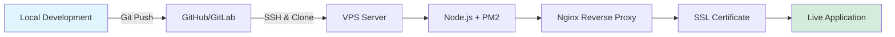

# 🚀 Hostinger VPS Deployment Guide

Complete guide for deploying your Push Notification System to Hostinger VPS with Node.js, PM2, and Nginx.

---

## 📋 Prerequisites

Before starting, ensure you have:

- ✅ Hostinger VPS account with root/sudo access
- ✅ Domain name pointed to your VPS IP
- ✅ SSH access to your VPS
- ✅ Basic knowledge of Linux terminal commands

---

## 🎯 Deployment Overview



**Tech Stack on VPS:**
- Ubuntu 20.04/22.04 LTS
- Node.js 18.x or 20.x LTS
- PM2 (Process Manager)
- Nginx (Reverse Proxy)
- Let's Encrypt SSL (Free HTTPS)

---

## 📝 Step-by-Step Deployment

### Step 1: Connect to Your Hostinger VPS

```bash
# SSH into your VPS (replace with your VPS IP)
ssh root@your-vps-ip

# Or if you have a non-root user
ssh username@your-vps-ip
```

> [!TIP]
> Find your VPS IP in Hostinger's control panel under VPS → Overview

---

### Step 2: Update System & Install Dependencies

```bash
# Update package list
sudo apt update && sudo apt upgrade -y

# Install essential packages
sudo apt install -y curl wget git build-essential

# Install Node.js 20.x LTS (recommended)
curl -fsSL https://deb.nodesource.com/setup_20.x | sudo -E bash -
sudo apt install -y nodejs

# Verify installation
node --version  # Should show v20.x.x
npm --version   # Should show 10.x.x
```

---

### Step 3: Install PM2 (Process Manager)

```bash
# Install PM2 globally
sudo npm install -g pm2

# Verify installation
pm2 --version

# Set PM2 to start on system boot
pm2 startup systemd
# Follow the command output to complete setup
```

> [!IMPORTANT]
> PM2 keeps your Node.js app running 24/7 and auto-restarts it if it crashes.

---

### Step 4: Set Up Project Directory

```bash
# Create application directory
sudo mkdir -p /var/www/push-notification
sudo chown -R $USER:$USER /var/www/push-notification
cd /var/www/push-notification
```

---

### Step 5: Deploy Your Code

#### Option A: Using Git (Recommended)

```bash
# Initialize git repository on your local machine (if not done)
# cd to your local project directory
git init
git add .
git commit -m "Initial commit"

# Push to GitHub/GitLab
# Create a repo on GitHub, then:
git remote add origin https://github.com/yourusername/push-notification.git
git push -u origin main

# On VPS: Clone the repository
cd /var/www/push-notification
git clone https://github.com/yourusername/push-notification.git .
```

#### Option B: Using SCP (Quick Method)

```bash
# From your local machine, upload files to VPS
# Replace paths and IP accordingly
scp -r C:\Users\hp\Documents\Codezone\push-notification/* root@your-vps-ip:/var/www/push-notification/
```

#### Option C: Using FTP/SFTP

- Use FileZilla or WinSCP
- Connect to your VPS using SFTP
- Upload all files to `/var/www/push-notification/`

---

### Step 6: Install Dependencies & Generate VAPID Keys

```bash
cd /var/www/push-notification

# Install Node.js dependencies
npm install --production

# Generate VAPID keys
npm run generate-keys

# Verify .env file was created
cat .env
```

---

### Step 7: Configure Environment Variables

```bash
# Edit .env file
nano .env
```

Update with your production settings:

```env
VAPID_PUBLIC_KEY=<generated_public_key>
VAPID_PRIVATE_KEY=<generated_private_key>
PORT=3000
NODE_ENV=production
ADMIN_EMAIL=admin@yourdomain.com
```

**Press `Ctrl + O` to save, `Ctrl + X` to exit**

---

### Step 8: Start Application with PM2

```bash
# Start the application
pm2 start ecosystem.config.js

# Or if you don't have ecosystem.config.js:
pm2 start server.js --name push-notification

# Check status
pm2 status

# View logs
pm2 logs push-notification

# Save PM2 process list
pm2 save
```

> [!TIP]
> Your app is now running on `http://localhost:3000` but not accessible from the internet yet. We'll set up Nginx next.

---

### Step 9: Install & Configure Nginx

```bash
# Install Nginx
sudo apt install -y nginx

# Check Nginx status
sudo systemctl status nginx

# If not running, start it
sudo systemctl start nginx
sudo systemctl enable nginx
```

#### Create Nginx Configuration

```bash
# Create new site configuration
sudo nano /etc/nginx/sites-available/push-notification
```

**Paste this configuration** (replace `yourdomain.com` with your actual domain):

```nginx
server {
    listen 80;
    server_name yourdomain.com www.yourdomain.com;

    # Redirect HTTP to HTTPS (will be enabled after SSL setup)
    # return 301 https://$server_name$request_uri;

    location / {
        proxy_pass http://localhost:3000;
        proxy_http_version 1.1;
        proxy_set_header Upgrade $http_upgrade;
        proxy_set_header Connection 'upgrade';
        proxy_set_header Host $host;
        proxy_set_header X-Real-IP $remote_addr;
        proxy_set_header X-Forwarded-For $proxy_add_x_forwarded_for;
        proxy_set_header X-Forwarded-Proto $scheme;
        proxy_cache_bypass $http_upgrade;
    }

    # Security headers
    add_header X-Frame-Options "SAMEORIGIN" always;
    add_header X-Content-Type-Options "nosniff" always;
    add_header X-XSS-Protection "1; mode=block" always;

    # Logging
    access_log /var/log/nginx/push-notification-access.log;
    error_log /var/log/nginx/push-notification-error.log;
}
```

**Save and exit** (`Ctrl + O`, `Ctrl + X`)

#### Enable the Site

```bash
# Create symbolic link to enable site
sudo ln -s /etc/nginx/sites-available/push-notification /etc/nginx/sites-enabled/

# Test Nginx configuration
sudo nginx -t

# If test passes, reload Nginx
sudo systemctl reload nginx
```

---

### Step 10: Configure Firewall

```bash
# Allow Nginx through firewall
sudo ufw allow 'Nginx Full'

# If UFW is not active, enable it
sudo ufw enable

# Check firewall status
sudo ufw status
```

---

### Step 11: Install SSL Certificate (HTTPS)

> [!CAUTION]
> **HTTPS is REQUIRED** for Web Push API to work. Browsers will block push notifications on HTTP sites.

```bash
# Install Certbot
sudo apt install -y certbot python3-certbot-nginx

# Obtain SSL certificate (replace with your domain)
sudo certbot --nginx -d yourdomain.com -d www.yourdomain.com

# Follow the prompts:
# - Enter your email
# - Agree to terms
# - Choose whether to redirect HTTP to HTTPS (recommended: YES)

# Verify auto-renewal
sudo certbot renew --dry-run
```

**Certbot will automatically:**
- Obtain SSL certificate from Let's Encrypt
- Update Nginx configuration
- Set up auto-renewal (certificates expire every 90 days)

---

### Step 12: Update Client-Side Configuration

Since your domain has changed, update the server URL in your client code:

```bash
nano /var/www/push-notification/public/main.js
```

Find and update line 11:

```javascript
// Change from:
const SERVER_ORIGIN = "http://localhost:3000";

// To your domain:
const SERVER_ORIGIN = "https://yourdomain.com";
```

**Restart PM2 after changes:**

```bash
pm2 restart push-notification
```

---

### Step 13: Test Your Deployment

```bash
# Check if PM2 is running
pm2 status

# Check Nginx status
sudo systemctl status nginx

# View application logs
pm2 logs push-notification --lines 50

# Test the endpoint
curl http://localhost:3000/api/stats
```

**From your browser:**
1. Visit `https://yourdomain.com`
2. Click "Subscribe to Notifications"
3. Allow notifications when prompted
4. Click "Send Test Notification"
5. You should receive a notification!

---

## 🔒 Security Hardening (IMPORTANT)

### 1. Add API Authentication

Before going live, add authentication to protect your notification endpoint:

```bash
nano /var/www/push-notification/server.js
```

Add after line 36:

```javascript
// Generate a random API key
const API_KEY = process.env.API_KEY || 'your-secure-random-key-here';

// Add authentication middleware
app.post('/api/send-notification', async (req, res) => {
  // Check API key
  const authHeader = req.headers.authorization;
  if (authHeader !== `Bearer ${API_KEY}`) {
    return res.status(401).json({ error: 'Unauthorized' });
  }
  
  // ... rest of existing code
```

Add to `.env`:

```bash
echo "API_KEY=$(openssl rand -hex 32)" >> .env
```

Restart:

```bash
pm2 restart push-notification
```

### 2. Set Up Fail2Ban (Prevent Brute Force)

```bash
sudo apt install -y fail2ban
sudo systemctl enable fail2ban
sudo systemctl start fail2ban
```

### 3. Keep System Updated

```bash
# Create a cron job for weekly updates
sudo crontab -e

# Add this line:
0 3 * * 0 apt update && apt upgrade -y
```

---

## 🔄 Deployment Updates

When you make changes to your code:

```bash
# Connect to VPS
ssh root@your-vps-ip

# Navigate to project
cd /var/www/push-notification

# Pull latest changes (if using Git)
git pull origin main

# Install any new dependencies
npm install --production

# Restart PM2
pm2 restart push-notification

# Check logs
pm2 logs push-notification
```

---

## 📊 Monitoring & Maintenance

### View Logs

```bash
# PM2 logs (application)
pm2 logs push-notification

# Nginx access logs
sudo tail -f /var/log/nginx/push-notification-access.log

# Nginx error logs
sudo tail -f /var/log/nginx/push-notification-error.log

# System logs
sudo journalctl -u nginx -f
```

### Monitor Server Resources

```bash
# Install htop
sudo apt install -y htop

# Run htop
htop

# Check disk space
df -h

# Check memory usage
free -h

# PM2 monitoring
pm2 monit
```

### Set Up PM2 Monitoring Dashboard (Optional)

```bash
# Register for PM2.io account (free tier available)
pm2 link <secret_key> <public_key>

# Now monitor your app at https://app.pm2.io
```

---

## 🔧 Troubleshooting

### Issue: Application Not Accessible

```bash
# Check if Node.js app is running
pm2 status

# If stopped, check logs
pm2 logs push-notification

# Restart app
pm2 restart push-notification
```

### Issue: Nginx Error

```bash
# Test Nginx configuration
sudo nginx -t

# Check Nginx status
sudo systemctl status nginx

# Restart Nginx
sudo systemctl restart nginx

# View error logs
sudo tail -f /var/log/nginx/error.log
```

### Issue: Port Already in Use

```bash
# Check what's using port 3000
sudo lsof -i :3000

# Kill the process if needed
sudo kill -9 <PID>

# Restart your app
pm2 restart push-notification
```

### Issue: SSL Certificate Problems

```bash
# Test certificate renewal
sudo certbot renew --dry-run

# Force renewal if needed
sudo certbot renew --force-renewal

# Check certificate expiry
sudo certbot certificates
```

### Issue: Notifications Not Working

1. **Verify HTTPS is working** - Push API requires HTTPS
2. **Check browser console** for errors
3. **Verify VAPID keys** are correctly set in `.env`
4. **Check firewall** allows HTTPS (port 443)

```bash
# Check if .env has VAPID keys
cat /var/www/push-notification/.env

# Regenerate keys if needed
cd /var/www/push-notification
npm run generate-keys
pm2 restart push-notification
```

---

## 📱 Quick Reference Commands

```bash
# Start/Stop/Restart
pm2 start ecosystem.config.js
pm2 stop push-notification
pm2 restart push-notification
pm2 reload push-notification  # Zero-downtime reload

# Logs
pm2 logs
pm2 logs push-notification --lines 100
pm2 flush  # Clear logs

# Monitoring
pm2 monit
pm2 status
pm2 describe push-notification

# Nginx
sudo systemctl start nginx
sudo systemctl stop nginx
sudo systemctl restart nginx
sudo systemctl reload nginx
sudo nginx -t

# SSL
sudo certbot renew
sudo certbot certificates

# Updates
git pull origin main
npm install --production
pm2 restart push-notification
```

---

## 🎉 Success Checklist

After deployment, verify:

- [ ] ✅ Application accessible at `https://yourdomain.com`
- [ ] ✅ SSL certificate valid (green padlock in browser)
- [ ] ✅ Can subscribe to notifications
- [ ] ✅ Can receive test notifications
- [ ] ✅ PM2 running and auto-starts on reboot
- [ ] ✅ Nginx properly proxying requests
- [ ] ✅ Firewall configured correctly
- [ ] ✅ Logs are accessible and readable

---

## 📞 Support Resources

- **Hostinger VPS Docs**: https://www.hostinger.com/tutorials/vps
- **PM2 Documentation**: https://pm2.keymetrics.io/docs/usage/quick-start/
- **Nginx Documentation**: https://nginx.org/en/docs/
- **Let's Encrypt**: https://letsencrypt.org/docs/

---

## 🚨 Production Checklist (Before Going Live)

> [!WARNING]
> Complete these security steps before accepting real traffic:

- [ ] Add API authentication
- [ ] Implement rate limiting
- [ ] Set up database (replace subscriptions.json)
- [ ] Configure backup system
- [ ] Set up monitoring/alerting
- [ ] Test disaster recovery
- [ ] Document API for users
- [ ] Set up error tracking (Sentry/Rollbar)

---

**Deployment Guide Version**: 1.0  
**Last Updated**: 2025-11-26  
**Compatibility**: Hostinger VPS, Ubuntu 20.04/22.04
